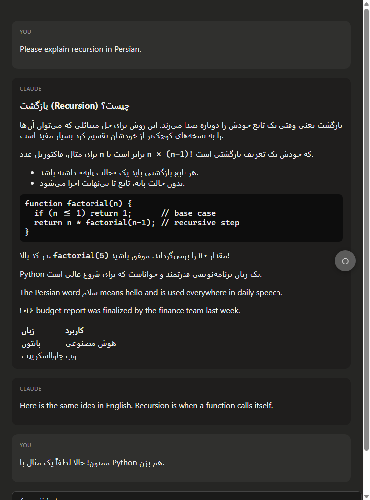
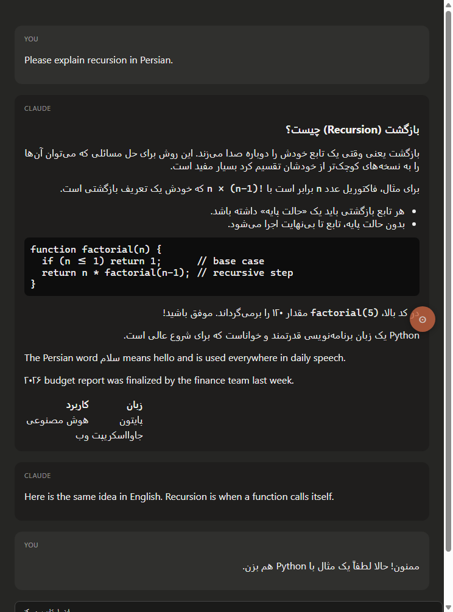

<div align="center">


# RTL Switch for Claude

**Fix right‑to‑left (Persian / Arabic / Hebrew) text in Claude — with a one‑click toggle.**

**English** · [فارسی 🇮🇷](README.fa.md)


</div>

When Claude answers in Persian/Arabic, the text is rendered **left‑aligned (LTR)** and looks broken.
This tool detects the language of each paragraph and fixes the direction: **Persian → right‑aligned,
English & code → left‑aligned.** A small floating button lets you switch between **Auto / Force‑RTL /
Off** at any time.

Works on both **claude.ai (browser)** and the **Claude Desktop app**.

## Demo

| Before — Persian is left‑aligned (broken) | After — Auto mode fixes it |
|:---:|:---:|
|  |  |

<sub>Illustrative screenshots on a mock chat. Notice the English sentence and the code block correctly stay left‑aligned.</sub>

## Features

- 🎯 **Per‑paragraph auto‑direction** — each paragraph is decided by its **majority of letters**, so a
  Persian sentence that *starts with* an English word (e.g. “Python یک زبان است”) is still right‑aligned.
- 🔀 **Three modes** — Auto, Force‑RTL, Off. Your choice is remembered.
- 🧮 **Code & math stay LTR** — `pre`, `code`, and KaTeX are never flipped.
- 📊 **Tables fixed** — Persian tables get their columns ordered right‑to‑left.
- ⚡ **Fast** — only re‑processes the part of the page that changed while Claude streams.
- 🧩 **Robust** — doesn’t depend on Claude’s internal CSS class names, so UI updates won’t break it.
- 🔒 **Private** — no servers, no tracking. Only your selected mode is stored locally.

## The switch button

- **Left‑click** the floating button → open the 3‑mode menu.
- **Right‑click** → quickly cycle Auto → RTL → Off.
- **Drag** it anywhere; its position is remembered.

| Mode | Icon | What it does |
|------|:---:|--------------|
| **Auto** | ☉ | Each paragraph follows its own language. Best for mixed Persian/English. *(recommended)* |
| **Force‑RTL** | ← | Anything containing Persian/Arabic is forced right‑to‑left; English‑majority text is left alone. |
| **Off** | ○ | Restores Claude’s original behavior. |

---

## Install — Browser (claude.ai) ✅ recommended

The clean, permanent option. Install once, works forever.

### Chrome / Edge / Brave

1. **Download this project** (green **Code** button → *Download ZIP*, then unzip; or `git clone`).
2. Open your browser’s extensions page:
   - Chrome → `chrome://extensions`
   - Edge → `edge://extensions`
   - Brave → `brave://extensions`
3. Turn on **Developer mode** (top‑right).
4. Click **Load unpacked**.
5. Select the **`extension`** folder inside this project.
6. Go to `claude.ai` (if it was already open, **refresh** the tab once).
   The orange round button appears on the right edge of the page.

> Don’t delete the `extension` folder — the browser loads the extension from it.

### Firefox (optional / experimental)

1. Go to `about:debugging#/runtime/this-firefox`.
2. Click **Load Temporary Add‑on…**
3. Select `extension/manifest.json`.
   (Temporary add‑ons are removed when Firefox restarts.)

---

## Install — Claude Desktop app

**Why is it different here?** The Claude Desktop app is security‑hardened (remote debugging is disabled
and file integrity is validated), so no extension or permanent add‑on can be installed. The only
supported way is to run a short snippet in the app’s own **DevTools Console**.

1. Open the Claude Desktop app.
2. **Right‑click** anywhere in the window → **Inspect Element**.
   (This item exists because `allowDevTools` is enabled — see below if you don’t see it.)
3. Click the **Console** tab at the top.
4. Open [`desktop/claude-desktop-rtl.js`](desktop/claude-desktop-rtl.js), **select all** (Ctrl+A) and
   **copy** (Ctrl+C), then click in the Console and **paste** (Ctrl+V).
   - First time, Chromium may ask you to type **`allow pasting`** — type it, press Enter, then paste again.
5. Press **Enter**. The round button appears on the right edge. Done.

You can close DevTools; the button and the fix stay.

<details>
<summary>Don’t see “Inspect Element”? Enable DevTools first (one time)</summary>

Create this file:

`%LOCALAPPDATA%\Claude-3p\developer_settings.json`

with:

```json
{ "allowDevTools": true }
```

Then fully quit and reopen Claude Desktop.
</details>

> **Desktop limitation:** because the app blocks automated injection, the snippet is cleared when you
> **fully close** the app. Each time you reopen Claude Desktop you paste it once more (while the app
> stays open, nothing to redo). For a hassle‑free daily experience, prefer the **browser extension**.

Full step‑by‑step (with the DevTools‑enable steps): [`desktop/HOW-TO-DESKTOP.md`](desktop/HOW-TO-DESKTOP.md).

---

## How it works

The core is the standard HTML `dir` attribute plus a small direction detector. For every block‑level
text element (paragraph, list, heading, table cell…) the engine counts strong RTL vs LTR letters
(ignoring weak characters such as Persian digits) and sets `dir` to `rtl`, `ltr`, or `auto`
accordingly, then adds a little CSS so alignment follows direction. Code and math are explicitly kept
LTR. A `MutationObserver` re‑applies the fix to messages as they stream in — but only to the parts of
the DOM that actually changed, to stay smooth on long chats. Because it targets generic HTML elements
rather than Claude’s CSS classes, Claude UI updates don’t break it.

## Project structure

```
rtl-switch-button/
├── README.md / README.fa.md       Bilingual documentation
├── LICENSE
├── shared/rtl-engine.js           The core engine (single source of truth)
├── extension/                     MV3 browser extension
│   ├── manifest.json
│   ├── rtl-engine.js              (copy of the engine)
│   ├── content.js                 popup ⇄ engine bridge
│   ├── popup.html / popup.js
│   └── icons/
├── desktop/
│   ├── claude-desktop-rtl.js      Paste‑into‑DevTools snippet
│   └── HOW-TO-DESKTOP.md
├── test/
│   ├── mock-claude.html           Mock of Claude’s chat DOM
│   ├── cdp-test.js                33 automated checks in real Chrome (no deps)
│   └── make-icons.js              Generates the PNG icons (no deps)
└── assets/                        Screenshots & logo
```

## Development & testing

```bash
node test/cdp-test.js      # runs 33 assertions in real headless Chrome (no npm install needed)
node test/make-icons.js    # regenerate the extension icons
```

The test harness drives a real browser over the Chrome DevTools Protocol using Node’s built‑in
WebSocket (zero dependencies), applies each mode, reads back the computed `direction`, and captures
screenshots to `test/shots/`.

If you edit `shared/rtl-engine.js`, copy it to `extension/rtl-engine.js` and `desktop/claude-desktop-rtl.js`
(the desktop copy just has a one‑line header prepended) and re‑run the tests.

## Privacy

No data is collected and nothing is sent anywhere. The tool only changes how text is displayed in your
browser. The single thing stored is your selected mode, in the browser’s `localStorage`.

## License

[MIT](LICENSE) — free to use, modify, and share.
